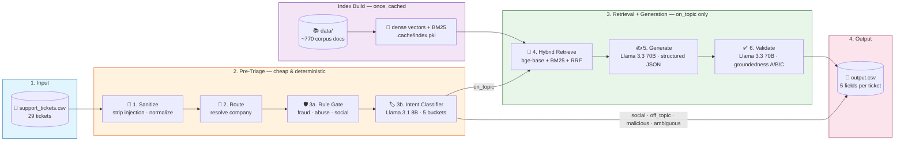

# Support Ticket Triage System

A defensive, **RAG-grounded multi-stage AI agent** that triages real-world support tickets
across three product ecosystems — **HackerRank**, **Claude**, and **Visa** — using only a
local support corpus (no live web calls).
Built with **HuggingFace Inference Providers**, **hybrid retrieval (dense + BM25)**, and
**Llama 3.3 70B** structured reasoning for the HackerRank Orchestrate hackathon (May 2026).

For each ticket the agent decides a **status**, **request type**, **product area**, a
**grounded response**, and a **justification** — and it escalates to a human rather than
guess whenever a ticket is high-risk, malicious, or unsupported by the corpus.

---

## **Features**

- **Defensive 6-Stage Pipeline:** Cheap deterministic checks run first; expensive LLM
  generation only fires after a ticket is sanitized, company-scoped, and confirmed safe.
- **Prompt-Injection & Jailbreak Defense:** A deterministic rule gate strips injection
  markers (English / French / Spanish) and short-circuits fraud, abuse, and account-access
  attacks *before* any model call.
- **Hybrid Retrieval (RAG):** Dense embeddings (`bge-base-en-v1.5`) + BM25 sparse search,
  fused with **Reciprocal Rank Fusion**, company-scoped and doc-deduplicated to top-5.
- **Structured LLM Reasoning:** A single Llama 3.3 70B call emits all five output fields
  jointly as schema-validated JSON — no lossy free-text parsing.
- **Groundedness Self-Check:** A second 70B validator catches hallucinated policies,
  entity mismatches, and ignored user constraints, and force-escalates them.
- **Deterministic by Design:** `temperature=0`, pinned models, seeded chunking — two runs
  on the same input produce the same `output.csv`.
- **On-Disk Caching:** The retrieval index and per-query embeddings are cached so re-runs
  skip the network and complete in seconds.
- **Offline Test Suite:** `pytest` unit tests cover CSV I/O, corpus chunking, triage rules,
  agent helpers, and failsafe behavior — no API calls required.

---

## **Architecture**



Full design rationale lives in [`architecture.md`](./architecture.md); the step-by-step
build log in [`plan.md`](./plan.md); code-level details in [`code/README.md`](./code/README.md).

---

## **Project Structure**

```
.
├── architecture.md              # design + rationale (what & why)
├── plan.md                      # step-by-step build log (execution)
├── problem_statement.md         # task spec + I/O schema
├── code/                        # ← the agent
│   ├── main.py                  #   entry point (argparse, per-ticket loop)
│   ├── agent.py                 #   Stage 5 + 6 + process_ticket orchestrator
│   ├── triage.py                #   Stage 1 sanitize + 3a rules + 3b classifier
│   ├── retriever.py             #   Stage 4 hybrid index + RRF search + caches
│   ├── corpus.py                #   markdown loader + chunker + product_area vocab
│   ├── prompts.py               #   Stage 5 system/user prompt templates
│   ├── llm.py                   #   one HF client: call_chat, parse, throttle
│   ├── io_csv.py                #   strict CSV read/write with header validation
│   ├── debug_rows.py            #   per-row trace (rules → retrieval → 5 → 6)
│   ├── tests/                   #   offline pytest suite
│   ├── requirements.txt
│   └── README.md
├── data/                        # local support corpus (~770 markdown docs)
│   ├── hackerrank/              #   HackerRank help center
│   ├── claude/                  #   Claude help center export
│   └── visa/                    #   Visa consumer + small-business support
└── support_tickets/
    ├── support_tickets.csv      # inputs (run your agent on these)
    ├── sample_support_tickets.csv  # inputs + expected outputs (for dev)
    └── output.csv               # agent predictions
```

---

## **Setup Instructions**

### 1. **Clone the Repository**

```bash
git clone https://github.com/VIVPM/hackerrank-support-triage-system-hackathon.git
cd hackerrank-support-triage-system-hackathon
```

### 2. **Set Up Python Environment**

It is recommended to use a virtual environment.

```bash
python -m venv .venv
source .venv/bin/activate   # (Linux/Mac)
.venv\Scripts\activate      # (Windows)
```

### 3. **Install Dependencies**

```bash
pip install -r code/requirements.txt
```

**Key dependencies include:**
- openai (HF Inference Providers OpenAI-compatible client)
- huggingface_hub
- rank_bm25
- numpy
- pandas
- python-dotenv
- tqdm
- pytest

### 4. **Environment Variables**

Copy `.env.example` → `.env` in the project root and add your HuggingFace token:

```
HF_TOKEN=hf_xxxxxxxxxxxxxxxxxxxxx
```

Get a token at <https://huggingface.co/settings/tokens> — **Read** scope is enough.
`.env` is gitignored — never commit it.

### 5. **Accept Model Licenses (one-time)**

On huggingface.co, accept the license for the two gated models the agent calls:
- `meta-llama/Llama-3.3-70B-Instruct` (Stage 5 + 6)
- `meta-llama/Llama-3.1-8B-Instruct` (Stage 3b)

---

## **Running the Application**

```bash
python code/main.py                     # full run over all 29 tickets
python code/main.py --only-rows 13,14   # debug specific rows (1-indexed)
python code/debug_rows.py 13,14         # rich per-row trace of every stage
```

Predictions are written to **`support_tickets/output.csv`**. The first run builds the
retrieval index (~3–5 min over the HF API) and caches it; subsequent runs load it instantly.

Run the offline test suite with:

```bash
pytest code/tests
```

---

## **How It Works**

For every ticket the pipeline runs top-to-bottom, short-circuiting as early as possible:

1. **Sanitize** — strip control chars, normalize whitespace, and remove prompt-injection
   markers, keeping the original text for logging.
2. **Route** — if the `Company` field is known, use it as a hard retrieval filter; if it's
   `None`, defer the company decision to the intent classifier.
3. **Rule Gate (3a)** — deterministic regex catches unambiguous cases: identity theft /
   fraud → escalate, score disputes → escalate, jailbreak/abuse → `malicious`, greetings →
   `social`. These never reach an LLM.
4. **Intent Classifier (3b)** — Llama 3.1 8B sorts the rest into one of five buckets:
   `social`, `off_topic`, `malicious`, `on_topic`, `ambiguous_real`. Only `on_topic`
   continues; everything else short-circuits to a fixed output shape.
5. **Hybrid Retrieve** — for `on_topic` tickets, fetch the top-5 company-scoped passages by
   fusing dense-embedding and BM25 rankings with Reciprocal Rank Fusion.
6. **Generate** — one Llama 3.3 70B structured-output call produces all five fields, drafting
   a response grounded *only* in the retrieved passages.
7. **Validate** — a second 70B call checks the answer against three groundedness criteria
   (factual support, question fit, no fabrication) and force-escalates anything that fails.

---

## **Environment Variables**

| Variable | Required | Purpose |
|---|---|---|
| `HF_TOKEN` | **yes** | HuggingFace Inference Providers auth |
| `STAGE5_MODEL` | no | Override the Stage 5/6 model (default Llama 3.3 70B) |
| `STAGE3B_MODEL` | no | Override the Stage 3b classifier (default Llama 3.1 8B) |
| `HF_PROVIDER` | no | Pin a backend (`together`, `fireworks-ai`, `cerebras`, …) |
| `LLM_THROTTLE_EVERY` | no | Sleep after every N successful calls (default 4) |
| `LLM_THROTTLE_SLEEP` | no | Seconds to sleep when throttling (default 30) |

Secrets are read from `.env` only. Never hardcode keys.

---

## **Key Concepts Used**

- **RAG (Retrieval-Augmented Generation):** Answers are grounded in retrieved corpus
  passages, never in the model's parametric memory — the core defense against hallucinated
  policies.
- **Hybrid Retrieval:** Dense semantic search (catches paraphrase) + BM25 lexical search
  (catches exact jargon like `Chakra`, `LTI key`, `Bedrock`) for the best of both.
- **Reciprocal Rank Fusion (RRF):** Parameter-free way to merge dense and sparse rankings
  without normalizing incompatible score scales.
- **Structured Output / JSON Mode:** The generation call returns a schema-validated object,
  guaranteeing enum-correct fields instead of brittle text parsing.
- **Groundedness Validation:** A dedicated LLM judge scores the answer/document pair, acting
  as a fail-safe second opinion before anything is marked `Replied`.
- **HF Inference Providers:** One OpenAI-compatible client routes to the cheapest/fastest
  backend; models are swappable by changing a single string.
- **Determinism:** `temperature=0` everywhere so regressions are visible, not masked by
  sampling noise.

---

## **Extending the Project**

- **Swap models:** Set `STAGE5_MODEL` / `STAGE3B_MODEL` to any HF-served chat model
  (Qwen 2.5 72B, DeepSeek-V3, Mistral Large) — no code change.
- **Add a company / corpus:** Drop markdown docs under `data/<company>/` and extend the
  per-company `product_area` vocab in `corpus.py`; the index rebuilds automatically.
- **Tune retrieval:** Adjust top-K, chunk size, or the RRF constant in `retriever.py`.
- **Harden triage:** Add regex patterns to the Stage 3a rule gate in `triage.py`.

---

## **Troubleshooting**

- **`HF_TOKEN` not set / 401:** Ensure `.env` exists with a valid token and read scope.
- **403 on a model:** Accept the Llama model licenses on huggingface.co (see Setup step 5).
- **429 / rate limits:** The client auto-throttles; raise `LLM_THROTTLE_SLEEP` or pin a
  faster backend with `HF_PROVIDER`.
- **Stale results after editing the corpus:** Delete `code/.cache/` to force an index rebuild.
- **First run is slow:** Expected — it embeds ~770 chunks over the HF API once, then caches.

---

## **Results**

The agent was run over all **29 input tickets**, producing a deterministic `output.csv`.

#### 📊 Routing Outcome

| Outcome | Count | Reasoning |
|---|---|---|
| ✅ **Replied** | **11** | Grounded in a specific corpus doc (e.g. Pause Subscription, Certifications FAQ, Visa Core Rules, Claude LTI in Canvas). |
| 🚨 **Escalated** | **18** | Documented reason each: rule-gate (fraud / score / account access), ambiguous bug report, malicious pattern, no corpus answer, or a Stage-6 groundedness catch. |
| **Total** | **29** | Every row schema-valid across all 5 fields. |

Every `Replied` answer cites a real corpus passage, and every `Escalated` row carries an
auditable reason — the pipeline is tuned to **escalate rather than hallucinate** on any
borderline case.

#### 🧪 Reliability

- **Deterministic:** `temperature=0` + cached index → identical `output.csv` across runs.
- **Tested offline:** `pytest code/tests` exercises CSV I/O, corpus chunking, triage rules,
  agent helpers, and failsafe behavior with no network calls.

---

*Forked from the [interviewstreet/hackerrank-orchestrate-may26](https://github.com/interviewstreet/hackerrank-orchestrate-may26)
starter repo; the `code/` agent, design docs, and outputs are my own work.*
